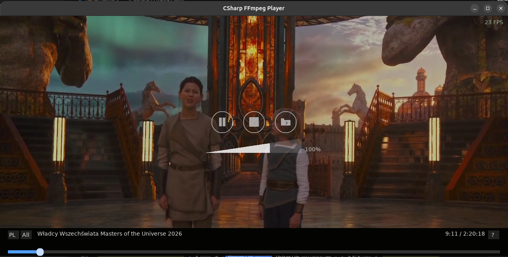
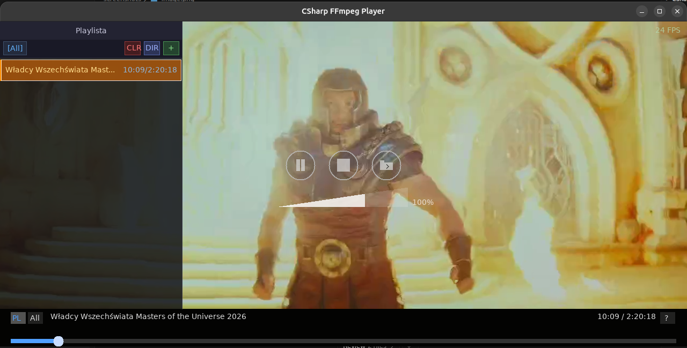

# CSharp FFmpeg Player

A lightweight, GPU-accelerated video and audio player for Linux, built in C# / .NET 8 with **FFmpeg** for decoding and **SDL2** for rendering and audio output.


---

## Features

- **GPU hardware acceleration** — VAAPI, CUDA, or VDPAU (auto-detected)
- **Wide format support** — MP4, MKV, AVI, MOV, WebM, FLV, WMV, MPG, MPEG, TS, M2TS, VOB, OGV, 3GP, RM, ASF, plus audio: MP3, AAC, FLAC, WAV, OGG, Opus, M4A, WMA, AC3, DTS, AIFF, ALAC
- **HLS streaming** — `.m3u8` / `.m3u` playlist support (native FFmpeg HLS demuxing)
- **Playlist management** — drag-and-drop reordering, repeat modes (Once / All / One / Shuffle), add files or folders
- **Thumbnail preview** — hover over the progress bar to see a frame preview at that timestamp
- **Subtitle support** — `.srt`, `.sub`, `.txt` with custom font rendering
- **Session restore** — remembers last position, volume, playlist, and window geometry
- **Graceful error handling** — corrupted files show an error overlay and auto-advance instead of crashing
- **Custom UI** — progress bar with seek, volume control, playlist panel, About dialog, context menu — all rendered with SDL2

---

## Screenshots






---

## Requirements

### System packages

| Dependency | Debian/Ubuntu | Fedora | Arch |
|---|---|---|---|
| .NET 8 SDK | `dotnet-sdk-8.0` | `dotnet-sdk-8.0` | `dotnet-sdk` |
| FFmpeg libs | `ffmpeg` + `libavcodec-dev` + `libavformat-dev` + `libavutil-dev` + `libswscale-dev` + `libswresample-dev` | `ffmpeg-devel` | `ffmpeg` |
| SDL2 | `libsdl2-dev` | `SDL2-devel` | `sdl2` |
| SDL2_ttf | `libsdl2-ttf-dev` | `SDL2_ttf-devel` | `sdl2_ttf` |
| Zenity (file dialogs) | `zenity` | `zenity` | `zenity` |

#### Install on Debian/Ubuntu

```bash
sudo apt update
sudo apt install dotnet-sdk-8.0 ffmpeg libavcodec-dev libavformat-dev libavutil-dev \
    libswscale-dev libswresample-dev libsdl2-dev libsdl2-ttf-dev zenity
```

#### Install on Fedora

```bash
sudo dnf install dotnet-sdk-8.0 ffmpeg-devel SDL2-devel SDL2_ttf-devel zenity
```

#### Install on Arch Linux

```bash
sudo pacman -S dotnet-sdk ffmpeg sdl2 sdl2_ttf zenity
```

### NuGet packages

These are restored automatically by `dotnet build`:

| Package | Version | Purpose |
|---|---|---|
| [`FFmpeg.AutoGen`](https://www.nuget.org/packages/FFmpeg.AutoGen/) | 8.1.0 | P/Invoke bindings for FFmpeg C libraries (libavcodec, libavformat, libavutil, libswscale, libswresample) |
| [`ppy.SDL2-CS`](https://www.nuget.org/packages/ppy.SDL2-CS/) | 1.0.82 | C# bindings for SDL2 and SDL2_ttf |

### Native libraries

The project bundles native `.so` files in the `lib/` directory. If the bundled libraries are compatible with your system, no additional setup is needed. Otherwise, the player auto-detects system-installed FFmpeg and SDL2 libraries.

**Bundled library versions:**

| Library | Version |
|---|---|
| libavcodec | 62.11.100 |
| libavformat | 62.3.100 |
| libavutil | 60.8.100 |
| libswscale | 9.1.100 |
| libswresample | 6.1.100 |
| libavfilter | 11.4.100 |
| libavdevice | 62.1.100 |
| SDL2 | 2.32.10 |
| SDL2_ttf | 2.22.0 |

---

## Building

```bash
git clone https://github.com/softbery/CSharpFFmpeg.git
cd CSharpFFmpeg
dotnet build -c Release
```

The built binary is at `bin/Release/net8.0/csharp-ffmpeg-player`.

---

## Usage

```bash
# Play a single file
dotnet run -c Release -- video.mp4

# Play with GPU acceleration
dotnet run -c Release -- video.mp4 -gpu

# Play with custom frame rate cap
dotnet run -c Release -- video.mp4 -gpu --fps 60

# Play with subtitles
dotnet run -c Release -- video.mp4 --subtitle subs.srt

# Play multiple files
dotnet run -c Release -- video1.mp4 video2.mp4 video3.mp4 -gpu

# Play from a playlist file (.m3u or .txt, one path per line)
dotnet run -c Release -- --playlist mylist.m3u -gpu

# Play audio file
dotnet run -c Release -- audio.mp3

# Specify custom library path (if FFmpeg/SDL2 are in a non-standard location)
dotnet run -c Release -- video.mp4 /usr/lib/x86_64-linux-gnu -gpu

# No arguments — restores last session or opens file dialog
dotnet run -c Release
```

### Command-line options

| Option | Description |
|---|---|
| `-gpu`, `--gpu` | Enable GPU hardware acceleration (VAAPI / CUDA / VDPAU, auto-detected) |
| `--fps N`, `-fps N` | Target render frame rate (e.g. 30, 60, 120, 144) |
| `--subtitle PATH`, `-sub PATH` | Load subtitle file (.srt, .sub, .txt) |
| `--playlist PATH`, `-pl PATH` | Load playlist file (.m3u, .m3u8, .txt — one file per line) |
| `--help`, `-h` | Show help message |
| `<file...>` | One or more media files to play sequentially |
| `<lib-path>` | Path to directory containing FFmpeg/SDL2 .so files (auto-detected if omitted) |

---

## Controls

### Keyboard

| Key | Action |
|---|---|
| **Space** | Play / Pause |
| **Left / Right** | Seek -10s / +10s |
| **Up / Down** | Volume up / down |
| **N** | Next track in playlist |
| **P** | Previous track in playlist |
| **F** | Toggle fullscreen |
| **ESC** | Exit fullscreen (or close About overlay) |
| **Q** | Quit |
| **TAB** | Toggle playlist panel |
| **Del** | Remove selected item from playlist |
| **Enter** | Play selected playlist item |

### Mouse

| Action | Result |
|---|---|
| **Click progress bar** | Seek to position |
| **Hover progress bar** | Thumbnail preview at that timestamp |
| **Drag progress bar** | Scrub through video |
| **Double-click video** | Toggle fullscreen |
| **Click playlist item** | Select (first click) / Play (second click) |
| **Drag playlist item** | Reorder playlist |
| **Right-click playlist item** | Context menu (remove, play) |
| **Mouse wheel on playlist** | Scroll playlist |
| **Mouse wheel on video** | Volume control |

---

## UI Elements

The entire user interface is rendered with SDL2 (no external UI toolkit). All elements are drawn directly on the renderer using SDL2 primitives and SDL2_ttf for text.

### Progress bar

Located at the bottom of the window (70px tall). Contains:

| Element | Description |
|---|---|
| **Seek track** | Horizontal bar showing playback position. Click or drag to seek. |
| **Time display** | Current position and total duration (e.g. `01:23 / 45:67`) |
| **Playlist toggle button** (`PL`) | Left side — shows/hides the playlist panel |
| **Repeat mode button** | Left side — cycles through: Once → All → One → Shuffle |
| **About button** (`?`) | Right side — opens the About overlay with app info and keyboard shortcuts |

### Thumbnail preview

When hovering the mouse over the seek track, a preview box (160×90px) appears above the cursor position showing the video frame at that timestamp. The preview includes:

- **Video frame** — decoded asynchronously in a separate thread (seek + single-frame decode)
- **Time label** — formatted timestamp below the frame
- **Stem line** — vertical line connecting the preview box to the cursor position on the track
- **Placeholder** — gray box is shown while the frame is being decoded

The thumbnail worker runs in a dedicated thread with debouncing (80ms) to avoid excessive seeks during rapid mouse movement.

### Playlist panel

A 340px wide panel on the left side of the window, visible when toggled. Contains:

#### Header (always visible, even during scrolling)

| Button | Label | Action |
|---|---|---|
| **Repeat mode** | `[Once]` / `[All]` / `[One]` / `[Shuf]` | Cycles repeat modes |
| **Add file** | `ADD` | Opens file dialog to add individual media files |
| **Add folder** | `DIR` | Opens folder dialog to add all media files from a directory (recursively) |
| **Clear playlist** | `CLR` | Removes all items from the playlist and stops playback |

#### Item list

- **Item height**: 42px per entry
- **Scrolling**: Mouse wheel scrolls the list; auto-scrolls to the current track when it changes
- **Hover highlight**: Item under the cursor is highlighted
- **Click behavior**: First click selects the item; second click (or Enter) plays it
- **Drag and drop**: Drag items to reorder the playlist
- **Right-click**: Opens context menu with "Remove" and "Play" options
- **Delete key**: Removes the selected item from the playlist

#### Repeat modes

| Mode | Behavior |
|---|---|
| **Once** | Plays through the playlist once, stops at the end |
| **All** | Loops the entire playlist from the beginning after the last track |
| **One** | Repeats the current track indefinitely |
| **Shuffle** | Plays tracks in random order |

### On-screen controls

Circular buttons overlaid on the video (bottom center, above the progress bar):

| Button | Icon | Action |
|---|---|---|
| **Play/Pause** | ▶ / ⏸ | Toggles playback |
| **Stop** | ■ | Stops playback and resets position |
| **Open File** | 📂 | Opens file dialog to load new media |

Buttons are highlighted on hover. The controls auto-hide after 7 seconds of mouse inactivity.

### Volume control

- **Vertical slider** on the right side of the window, visible when controls are shown
- **Range**: 0.0 to 1.5 (150% amplification)
- **Adjust**: Mouse wheel over video area, or drag the slider
- **HUD**: Volume percentage displayed when adjusting

### Overlays

#### Error overlay

When a corrupted or unsupported file is encountered, an error message is displayed as a centered overlay with a dark background. The overlay auto-hides after 4 seconds, and the player auto-advances to the next playlist item (if any).

#### About overlay

A centered dialog showing:

- Application name and version
- Author and license info
- Full keyboard shortcut reference
- Closeable with ESC or clicking outside

### Context menu

Right-clicking a playlist item opens a context menu with:

- **Remove** — deletes the item from the playlist
- **Play** — starts playback of the item

### Session persistence

The player automatically saves the current state to a session file on exit:

- Playlist file paths
- Current track index
- Playback position (in seconds)
- Volume level
- Playlist panel visibility
- Window position and size

On next launch (without CLI arguments), the session is restored and playback resumes from the saved position.

---

## Architecture

### Project structure

```text
CSharpFFmpeg/
├── Program.cs              # Entry point, CLI argument parsing, native lib resolution
├── FFmpegDecoder.cs        # FFmpeg decoding: av_read_frame, avcodec_send/receive, sws_scale, swr_convert, seek, thumbnail
├── Player.cs               # Main event loop, A/V sync, decode thread, input handling, playlist logic
├── SDLRenderer.cs          # SDL2 window, YUV texture rendering, audio output, UI drawing (progress bar, playlist, overlays)
├── SDLTtf.cs               # SDL2_ttf P/Invoke wrappers for text rendering
├── Playlist.cs             # Playlist model: add, remove, move, advance, shuffle, repeat modes, HLS folder detection
├── SessionManager.cs       # Session save/restore (position, volume, playlist, window geometry)
├── subtitles/              # Subtitle parsing and rendering subsystem
│   ├── Subtitle.cs
│   ├── SubtitleManager.cs
│   ├── SubtitleFontArgs.cs
│   ├── SubtitleExtensions.cs
│   ├── SubtitleLoadException.cs
│   └── SubtitleParseException.cs
├── lib/                    # Bundled native .so libraries (FFmpeg + SDL2)
└── CSharpFFmpeg.csproj     # Project file (.NET 8, NuGet references)
```

### Data flow

```text
Media file
  │
  ▼
avformat_open_input → avformat_find_stream_info
  │
  ├── Video stream
  │     av_read_frame → avcodec_send_packet → avcodec_receive_frame
  │       │
  │       ▼ (HW transfer if VAAPI/CUDA)
  │     sws_scale (→ YUV420P)
  │       │
  │       ▼
  │     SDL_UpdateYUVTexture → SDL_RenderCopy → SDL_RenderPresent
  │
  └── Audio stream
        av_read_frame → avcodec_send_packet → avcodec_receive_frame
          │
          ▼
        swr_convert (→ S16 stereo)
          │
          ▼
        PCM queue → SDL audio callback
```

### A/V synchronization

The player synchronizes video frames to the audio clock. Video frames are delayed or dropped based on the PTS difference between the video stream and the master clock (derived from audio playback position). A `Stopwatch`-based clock with `clockBasePts` offset provides smooth timing.

### Threading model

| Thread | Responsibility |
|---|---|
| **Main thread** | SDL event loop, rendering, UI, input handling |
| **Decode thread** | `av_read_frame` → `avcodec_send/receive` loop, fills video and audio queues |
| **Thumbnail thread** | On-demand seek + single-frame decode for progress bar hover preview |

### GPU acceleration

When `-gpu` is passed, the player attempts to initialize hardware decoding in this order:

1. **VAAPI** (Video Acceleration API — Intel/AMD on Linux)
2. **CUDA** (NVIDIA)
3. **VDPAU** (Video Decode and Presentation API for Unix — NVIDIA/AMD)

If no hardware device is available, it falls back to CPU decoding automatically.

---

## License

MIT License — see [LICENSE](LICENSE) file for details.

```
Copyright (c) 2024 Softbery by Paweł Tobis
```

---

## Author

**Softbery by Paweł Tobis** — Paweł Tobis

- GitHub: [@softbery-org](https://github.com/softbery-org)

---

## Acknowledgements

- [FFmpeg](https://ffmpeg.org/) — multimedia framework for decoding/encoding
- [SDL2](https://www.libsdl.org/) — cross-platform multimedia library
- [FFmpeg.AutoGen](https://github.com/Ruslan-B/FFmpeg.AutoGen) — C# bindings for FFmpeg
- [ppy.SDL2-CS](https://github.com/ppy/SDL2-CS) — C# bindings for SDL2
